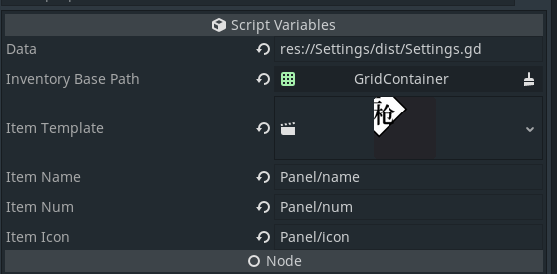
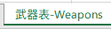
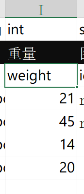

# FlowerInventory

## Overview

Lightweight inventory system plugin for Godot Engine.

## Quick start

Note: This plugin needs to be used with [kaluluosi/GDExcelExporter: 为Godot开发的excel表导出工具 (github.com)](https://github.com/kaluluosi/GDExcelExporter#readme) (later called the guide table plugin, the The data tables are called tables) used together. (Not together can also be used, just the data will be painful to write by hand)

1. First you need a template node for the item (hereafter called item template), which needs to have child nodes showing the number of items, their names, and icons (optional). And there needs to be a script for.
   
   ```gdscript
   extends Control # Customizable
   
   export(int) var item_id
   export(String) var item_type
   
   var item_num:int
   ```

2. You need to have an inventory scene that shows the inventory UI.

3. Add a Inventory node to the inventory scene.
   
   
   
   Set this node property.
   
   
   
   Explanation:
   
   - Data: The path to the Settings file generated using the Guided Table plugin.
   
   - Inventory Base Path: The parent node where you display the items.
   
   - Item Template: The item template scene.
   
   - Item Name: the path of the node where the item name is displayed in the Item Template scene.
   
   - Item Num: the path of the node in the Item Template scene that displays the number of items.
   
   - Item Icon: the node path of the item template scene that displays the item icon. (Optional)

4. Add a script to your inventory scene, using the following function.
   
   ```gdscript
   onready var inventory = $Inventory
   # Add item function
   # id: int type, the id of the item in the table
   # num: int type, the number of items to add
   # type: String type, the name of the sheet table in the form, as follows
   inventory.add_item(id, num, type)
   ```
   
   
   
   As above. type = Weapons
   
   ```gdscript
   # Delete item function, same parameters as above
   inventory.del_item(id, num, type)
   # Classified items function, type parameter as above
   inventory.type_item(type)
   
   # Sort items function
   # base：
   # String type。
   # The basis for sorting items, such as by weight, requires adding the relevant data to the table first, as shown below
   # way：
   # String type。
   # The order of sorting items, currently only "large_to_small" and "small_to_large"
   inventory.sort_item(base, way)
   ```
   
   
   
   base = weight

## Other

Thanks to 确实哥
