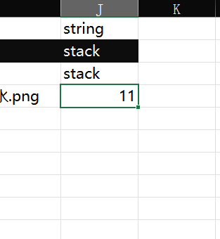

# FlowerInventory

## 语言 / Language

[english](READMEEN.MD)

## 概述

FlowerInventory是一个为Godot Engine开发的轻量级背包插件。

## 快速开始

注：本插件需要与 [kaluluosi/GDExcelExporter: 为Godot开发的excel表导出工具 (github.com)](https://github.com/kaluluosi/GDExcelExporter#readme) （后文称为导表插件，数据表称为表格）一起使用。（不一起用也可以，只是数据手写会很痛苦）

1. 首先你需要一个物品的模板节点（下文称为物品模板），该节点需要有显示物品数量、名称、图标（可选）的子节点。并且需要有一个脚本：
   
   ```gdscript
   extends Control # 此项可自定义
   
   var item_id:int
   var item_type:String
   var item_num:int
   ```

2. 你需要有一个背包场景，显示背包的UI。

3. 在背包场景中添加 Inventory 节点：
   
   
   
   设置该节点属性：
   
   
   
   讲解：
   
   - Data：使用导表插件生成的Settings脚本路径。
   
   - Inventory Base Path：你显示物品的父节点。
   
   - Item Template：物品模板场景。
   
   - Item Name：物品模板场景中显示物品名称的节点路径。
   
   - Item Num：物品模板场景中显示物品数量的节点路径。
   
   - Item Icon：物品模板场景中显示物品图标的节点路径。（可选）

4. 在你的背包场景中添加一个脚本，使用以下函数：
   
   ```gdscript
   onready var inventory = $Inventory
   # 添加物品函数
   # id: int类型，表格中物品的id
   # num: int类型，添加物品的数量
   # type: String类型，表格中sheet表的名字，如下图
   inventory.add_item(id, num, type)
   ```
   
   
   
   如上图 type = Weapons
   
   ```gdscript
   # 删除物品函数，参数同上
   inventory.del_item(id, num, type)
   # 分类物品函数，type参数同上
   inventory.type_item(type)
   # 排序物品函数
   # base：
   # String类型。
   # 排序物品的依据，如按重量排序，需要先在表格中添加相关数据，如下图
   # way：
   # String类型。
   # 排序物品的顺序，目前只有"large_to_small"和"small_to_large"，分别为从大到小和从小到大
   inventory.sort_item(base, way)
   ```
   
   
   
   base = weight
   
   如果你想要物品可以堆叠，你需要在Excel表格中添加stack属性，可以是任何属性、任何值，但只要有这个属性就代表此物品可以被堆叠，类似这样：
   
   

## 函数

```gdscript
get_all_item() -> Array
得到一个包含所有 Item 的数组，大概看起来像这样：
[[10001, "Weapons", 2], [10002, "Weapons", 4], [10015, "Weapons", 1]]
```

```gdscript
add_item(id: int, num: int, type: String) -> void
添加物品
```

```gdscript
del_item(id: int, num: int, type: String) -> Array
删除物品
```

```gdscript
sort_item(base: String, way: String) -> void
排序物品, way仅仅只有 "large_to_small" 和 "small_to_large"
```

```gdscript
type_item(type: String) -> void
分类物品
```

## 信号

```gdscript
● add_a_item()
    当添加一个 Item 时发出。
● added_item()
    当 add_item() 执行完毕后时发出。
● del_a_item()
    当删除一个 Item 时发出。
● deled_item()
    当 del_item() 执行完毕后时发出.
● sorted_item()
    当排序 Item 时发出。
● typed_item()
    当分类 Item 时发出。
```

## 其他

感谢确实哥
